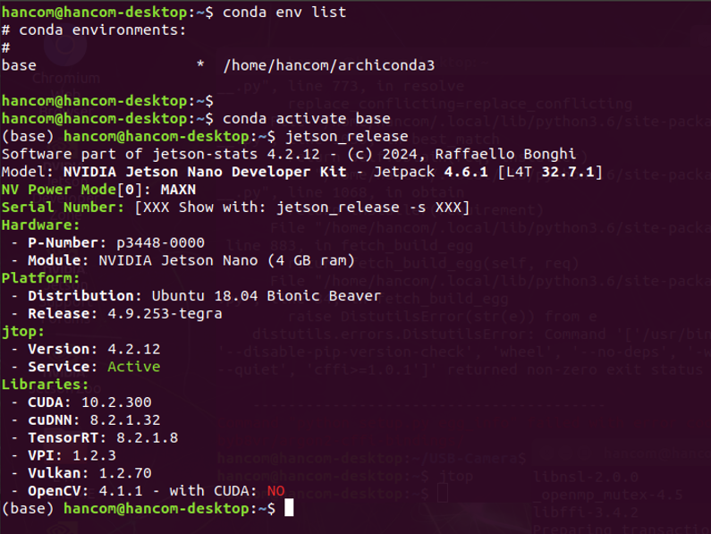
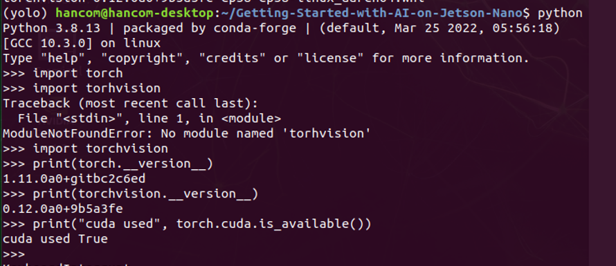

# Getting-Started-with-AI-on-Jetson-Nano

This is a Nvidia DLI project 

First install Archiconda3-0.2.3 
```
sh ./archiconda3-0.2.3-JetsonNano.sh
```
List conda environments, activate base env and check jetson status
```
conda env list  // list
conda activate base // activate
jetson_release // check
```


Create an environment for yolo and activate
```
conda create -n yolo python=3.8 -y
conda activate yolo
```


Install pytorch 1.11 and torchvision 0.12
```
sh ./installTorch-1.11TorchVisiion-0.12.sh
```

